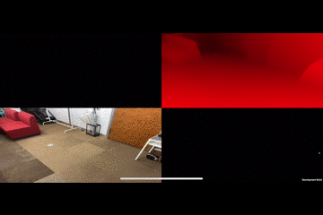

# UnityBarracuda-MiDas
Unity:2020.3.12f1 
 
単眼のRGBカメラから相対的な奥行きを推論するMiDaSの学習済みモデルを使って、UnityBarracudaで動作するプロジェクトです。 
カメラ毎で反転する可能性があるため画面の右側をクリック（タップ）すると左右反転し、左側だと上下反転します。 
iPhoneでもビルド出来ましたが、何故かロールバックするような描画になってしまいます（誰か解決方法教えて） 

## Learned model
[MiDaS v2.1 small](https://github.com/intel-isl/MiDaS/releases/tag/v2_1)
